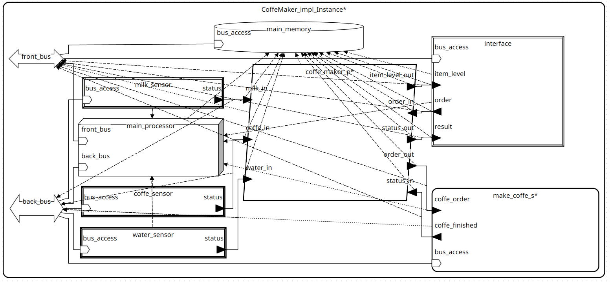
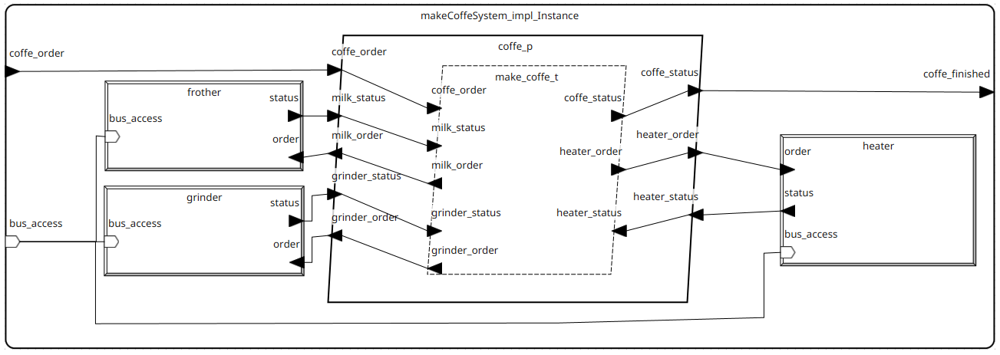

## Ekspres do kawy
Systemy czasu rzeczywistego, semestr letni 2025.
### Autor
* Mróz Michał 
* email: mmroz@student.agh.edu.pl

## Opis ogólny:
Model przedstawia opis ekspresu do kawy. Urządzenie pozwala na wybieranie napoju, oraz przeglądanie aktualnego stanu urządzenia (między innym ilości dostępnej kawy czy wody i mleka, jak również ich temperatury). 
Urządzenie powinno posiadać układ przetwarzający wybraną przez użytkownika operację, a następnie przedstawić proces działania wymagany do jego realizacji.
Urządzenie powinno składać się z interfejsu umożliwiającego użytkownikowi sterowanie nim, pamięci trwałej, procesora, oraz odpowiednich czujników i kontrolerów używanych do tworzenia napojów.

## Opis dla użytkownika:
Cała interakcja użytkownika z systemem prowadzona będzie przez udostępniony interfejs dający dostęp do różnych funkcjonalności. Zaliczają się do nich:
* Wybór napoju spośród listy przechowywanej w pamięci urządzenia.
* Kontrola zasobów (na przykład sprawdzenie dostępnej ilości kawy) przez wyświetlenie wartości odczytanych z odpowiednich czujników.
* Zapisywanie do pamięci preferencji użytkownika.

## Spis komponentów
### Typy danych

|Nazwa|Opis|
|-|-|
|`MilkOrder`| Typ zawierający informacje na temat mleka. Przechowuje dane typu Float `milk_amount` i typu Integer `froth_level` |
|`HeaterOrder`|Typ zawierający informacje o grzałce. Zawiera w sobie dane typu Float: `water_amount`, `heater_temp`, `brewing_time`|
|`CoffeOrder`|Typ zawierający informacje na temat przygotowywanego napoju. Przechowuje pola takie jak `CoffeAmount` typu float, pole `add_milk` typu Boolean oraz pola typu `HeaterOrder` i `MilkOrder`.|

### Urządzenia
|Nazwa|Opis|
|-|-|
|`Grinder`|Odpowiada urządzeniu młynka. Przyjmuje dane typu Float odpowiadające ilości kawy i zwraca informację typu Boolean o zakończeniu działania.|
|`Heater`|Odpowiada urządzniu grzałki. Przyjmuje dane typu `HeaterOrder` i zwraca informację typu Boolean o zakończeniu działania.|
|`Frother`|Spieniacz do mleka przyjmujący informację typu `MilkOrder` i zwracający informację typu Boolean o zakończeniu działania.|
|`Controller`|Odpowiada interfejsowi użytkownika.|
|`ItemSensor`|Czujnik sprawdzający stan danego elementu. Pomiar wykonywany jest na żądanie. Implementacyjnie rozdzielony jest na `ItemSensor.WaterSensor`, `ItemSensor.CoffeSensor`, `ItemSensor.MilkSensor`.|

### Wątki

|Nazwa|Opis|
|-|-|
|`readItemSensors_t`|Wątek odpowiada za odczytanie obecnych stanów zasobów przy wykorzystaniu urządzeń `ItemSensor`.
|`interfaceController_t`|Wątek odpowiadający za zbieranie danych wejściowych z urządzenia `Controller`.|
|`MakeCoffee_t`|Wątek odpowiadający za proces przygotowywania napoju.|

### Procesy
|Nazwa|Opis|
|-|-|
|`makeCoffe_p`|Proces kontrolujący przebieg tworzenia napoju.|
|`coffeMaker_p`|Proces przetwarzający zapytanie użytkownika i uruchamiający proces tworzenia napoju.|

### Systemy
|Nazwa|Opis|
|-|-|
|`makeCoffeSystem`|System obsługujący proces tworzenia napoju, zawierający urządzenia takie jak `grinder`, `heater` czy `frother`|
|`CoffeMaker`|Główny system urządzenia.|

### Urządzenia dodatkowe
System wyposażony jest w procesor `Processor` kontrolujący działanie systemu, oraz magistrale danych `FrontBus` i `BackBus`. Oprócz tego dołączona jest pamięć `MainMemory` przechowującą domyślne ustawienia.

## Diagram modelu
Poniżej przedstawione są diagramy przedstawiające poszczególne fragmenty stworzonego modelu.
### Schemat systemu `CoffeMaker`

### Schemat procesu `coffeMaker_p`

### Schemat systemu `makeCoffeSystem`

## Wykonane analizy
### WeightAnalysis
Analizy wagi komponentów przeprowadzona dla przedstawionego modelu zwróciła wyniki przedstawione w poniższej tabeli:

|Komponent|Waga|Maksymalna waga|
|-|-|-|
|water_sensor|0.1kg| - |
|coffe_sensor|0.1kg| - |
|milk_sensor|0.1kg| - |
|interface|0.25kg| - |
|main_memory|0.15kg| - |
|main_processor|0.1kg|-|
|grinder|0.5kg|-|
|heater|0.3kg|-|
|frother|0.2kg|-|
|make_coffe_s|0.2kg|-|
|CoffeMaker_impl|1.8kg|3.0kg|
Co oznacza, że wykorzystane jest 60% maksymalnej wagi.

### NotBoundResourceBudget
Poniżej przedstawiony jest wynik dla analizy 'Not Bound Resource Budget':
Resource Summary: 
  MIPS capacity 1,200 MIPS : MIPS budget 0,202 MIPS
  1 out of 1 with MIPS capacity
  6 out of 6 with MIPS budget

Detailed Processor MIPS Capacity Report 

Component,Capacity
processor main_processor, 1,200 MIPS,
Total, 1,200 MIPS,

Detailed MIPS Budget Report 

Component,Budget,Actual,Notes
device water_sensor, 0,000 MIPS,0,000 MIPS,
device coffe_sensor, 0,000 MIPS,0,000 MIPS,
device milk_sensor, 0,000 MIPS,0,000 MIPS,
device interface, 0,000 MIPS,0,000 MIPS,
  thread coffe_maker_p.item_sensor_t,   0,000 MIPS,  0,010 MIPS,
  thread coffe_maker_p.interface_t,   0,000 MIPS,  0,096 MIPS,
process coffe_maker_p, 0,900 MIPS,0,106 MIPS,process CoffeMaker_impl_Instance.coffe_maker_p total 0,106 MIPS below budget 0,900 MIPS (88,3 % slack)
  device make_coffe_s.grinder,   0,000 MIPS,  0,000 MIPS,
  device make_coffe_s.heater,   0,000 MIPS,  0,000 MIPS,
  device make_coffe_s.frother,   0,000 MIPS,  0,000 MIPS,
    thread make_coffe_s.coffe_p.make_coffe_t,     0,000 MIPS,    0,096 MIPS,
  process make_coffe_s.coffe_p,   1,000 MIPS,  0,096 MIPS,process CoffeMaker_impl_Instance.make_coffe_s.coffe_p total 0,096 MIPS below budget 1,000 MIPS (90,4 % slack)
system make_coffe_s, 0,900 MIPS,0,096 MIPS,system CoffeMaker_impl_Instance.make_coffe_s total 0,096 MIPS below budget 0,900 MIPS (89,3 % slack)
Total, ,0,202 MIPS,

## Źródła
- Kurs systemu czasu rzeczywistego, materiały udostępnione na platformie Upel.
- Poradnik języka AADL: https://github.com/GaloisInc/CASE-AADL-Tutorial/tree/main/aadl_book